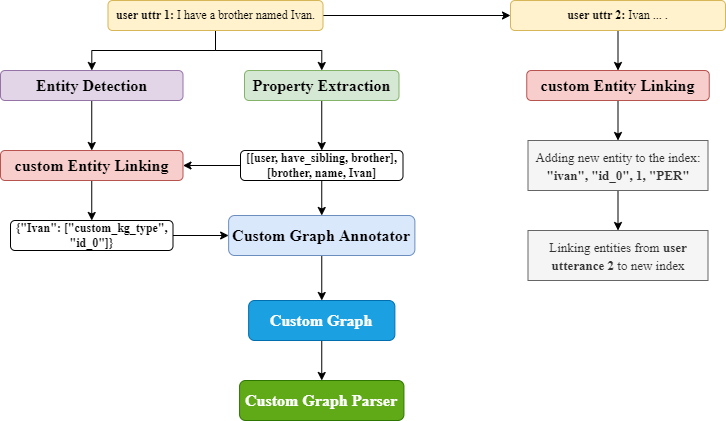

Concept
========

The system collects information about the User from dialogues in the form of relationship or property triplets and stores it in the Custom Knowledge Graph (KG). Stored information can be used in any Dream Skill.

Storing Information
--------------------

The storing pipeline cosists of the following steps:

* Extracting triplets from an utterance with the **Triplet extraction** service.
* Linking entities from the extracted triplet to the exsisting ones in the KG with the **Entity linking** service.
* Storing new relationships or properties in the KG with the **Custom Graph Annotator**.

Using Information
------------------

Using Custom KG in your skill should consist of the following steps:

* Formulating the query: decide what exactly do you want to know about the User.
* Using additional infromation from annotators. For example, use **Entity Detection** service and link  found entities to the ones in the Custom KG with **Custom Entity Linking** service.
* Getting the information with the help of **Custom KG API**.
* Parsing the information and using it as you wish.

See :doc:`../dialog_services/tutorials` for reference.

